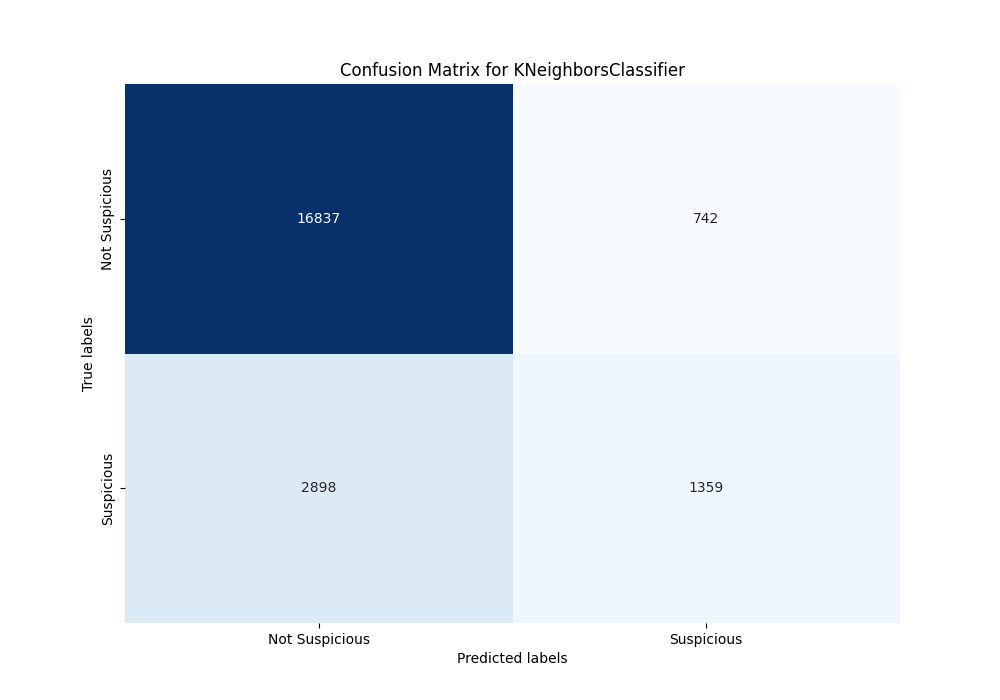
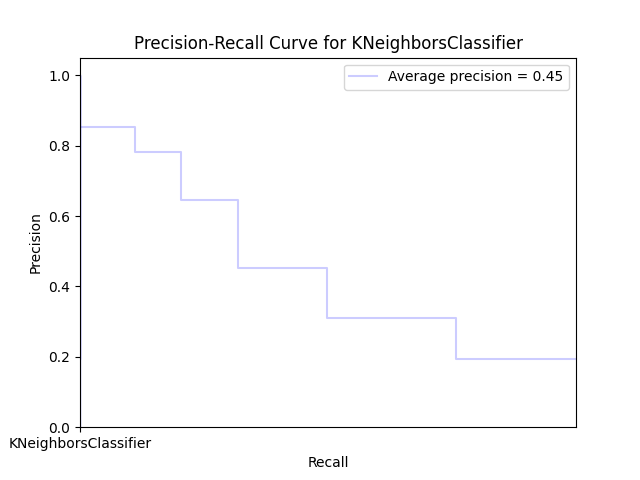

## Wyniki

```json
    {
        "KNeighborsClassifier accuracy": 0.8333028027111192
        "KNeighborsClassifier precision": 0.646834840552118
        "KNeighborsClassifier recall": 0.3192389006342495
        "KNeighborsClassifier F1-score": 0.4274929223026109
        "KNeighborsClassifier build time": 183 seconds
    }
```



Legenda:
    - True-Negative (Lewy górny róg, TN): Liczba poprawnie sklasyfikowanych ofert jako "niepodejrzane".
    - False-Positivve (Prawy górny róg, FP): Liczba ofert błędnie zakwalifikowanych jako "podejrzane", które faktycznie są poprawne.
    - False-Negative (Lewy dolny róg, FN): Liczba ofert błędnie zakwalifikowanych jako "niepodejrzane", które są podejrzane.
    - False-Positive (Prawy dolny róg, TP): Liczba poprawnie sklasyfikowanych ofert jako "podejrzane".


Legenda:
    - Precision (precyzja): Proporcja poprawnie zidentyfikowanych pozytywnych przypadków (TP) do wszystkich przypadków zidentyfikowanych jako pozytywne (TP + FP).
    - Recall (czułość): Proporcja poprawnie zidentyfikowanych pozytywnych przypadków (TP) do wszystkich faktycznie pozytywnych przypadków (TP + FN).
    - Area Under Curve (AUC): Ogólnie, im większe pole pod krzywą, tym lepsza zdolność modelu do klasyfikacji.
    - Średnia precyzja (Average Precision - AP): Średnia wartość precyzji dla różnych progów, obliczona jako ważona średnia zmian recall.

Wzory:
    - Dokładność (Accuracy) -  (TP + TN) / (TP + TN + FP + FN)
    - Precision (Precision) -  (TP) / (TP + FP)
    - Czułość (Recall) - (TP) / (TP + FN)
## Interpretacja

Confusion matrix:
    - Średnia precyzja (Average precision) o wartości 45% wskazuje przeciętną wydajność modelu
    - Dokładność (Accuracy) modelu  83.3% sugeruje, że model podejmuje poprawną decyzję w większości przypadków.
    - Precision (Precision) modelu  64.6% sugeruje, że model przewiduje ofertę jako "podejrzaną", jest ona faktycznie podejrzana w dwóch na trzy przypadki.
    - Czułość (Recall) modelu 31.9% pokazuje, że model identyfikuje tylko około jedną na pięć faktycznie "podejrzanych" ofert.
    - F1-score na poziomie 42.7% wskazuje nieco lepszą równowagę równowagę pomiędzy czułością i precyzją w porównianiu do modelu LogisticRegression. Sugeruje to, że model jest przeciętny w identyfikowaniu poejrzanych przypadków.
    - Model został zbudowany w 183 sekundy, co pozwala na szybkie zmiany i eksperymentownanie potencjalnie dając szansę na poprawę wyników.
