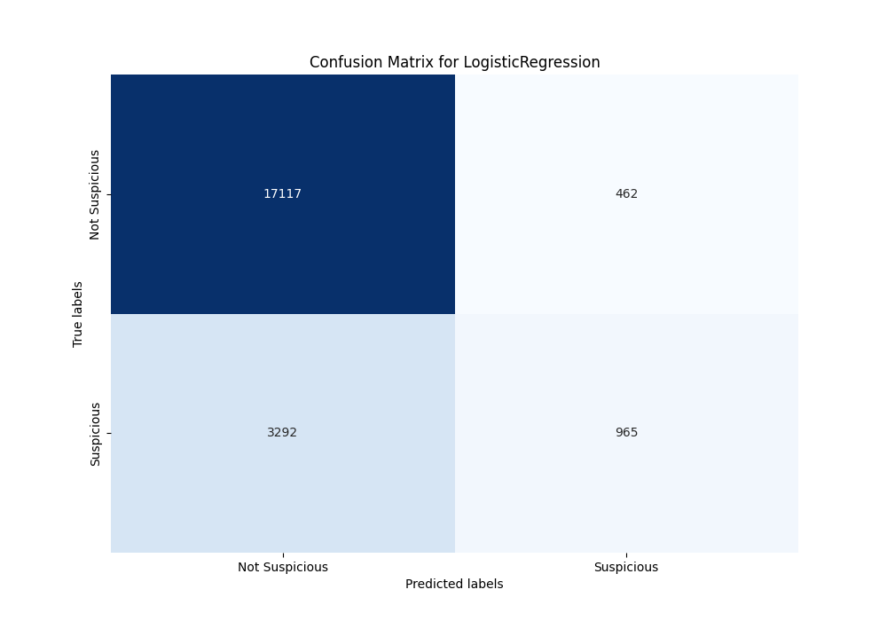
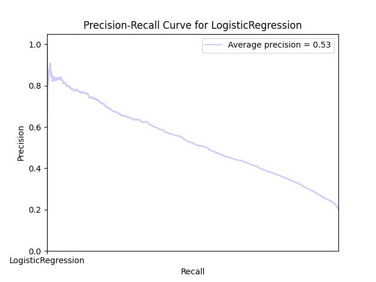

## Wyniki

```json
    {
        "RandomForestClassifier accuracy": 0.8402179886426085
        "RandomForestClassifier precision": 0.8163097199341022
        "RandomForestClassifier recall": 0.23279304674653511
        "RandomForestClassifier F1-score": 0.36227380734783404
        "RandomForestClassifier build time": 666 seconds
    }
```



Legenda:
    - True-Negative (Lewy górny róg, TN): Liczba poprawnie sklasyfikowanych ofert jako "niepodejrzane".
    - False-Positivve (Prawy górny róg, FP): Liczba ofert błędnie zakwalifikowanych jako "podejrzane", które faktycznie są poprawne.
    - False-Negative (Lewy dolny róg, FN): Liczba ofert błędnie zakwalifikowanych jako "niepodejrzane", które są podejrzane.
    - False-Positive (Prawy dolny róg, TP): Liczba poprawnie sklasyfikowanych ofert jako "podejrzane".


Legenda:
    - Precision (precyzja): Proporcja poprawnie zidentyfikowanych pozytywnych przypadków (TP) do wszystkich przypadków zidentyfikowanych jako pozytywne (TP + FP).
    - Recall (czułość): Proporcja poprawnie zidentyfikowanych pozytywnych przypadków (TP) do wszystkich faktycznie pozytywnych przypadków (TP + FN).
    - Area Under Curve (AUC): Ogólnie, im większe pole pod krzywą, tym lepsza zdolność modelu do klasyfikacji.
    - Średnia precyzja (Average Precision - AP): Średnia wartość precyzji dla różnych progów, obliczona jako ważona średnia zmian recall.

Wzory:
    - Dokładność (Accuracy) -  (TP + TN) / (TP + TN + FP + FN)
    - Precision (Precision) -  (TP) / (TP + FP) 
    - Czułość (Recall) - (TP) / (TP + FN)
## Interpretacja

Confusion matrix:
    - Średnia precyzja (Average precision) o wartości 0.53% wskazuje przeciętną wydajność modelu
    - Dokładność (Accuracy) modelu  84% sugeruje, że model podejmuje poprawną decyzję w większości przypadków.
    - Precision (Precision) modelu  81% sugeruje, że model przewiduje ofertę jako "podejrzaną", jest ona faktycznie podejrzana w czterech na pięć przypadków.
    - Czułość (Recall) modelu 23.2% pokazuje, że model identyfikuje tylko około jedną na pięć faktycznie "podejrzanych" ofert.
    - F1-score na poziomie 26.2% wskazuje niską równowagę pomiędzy czułością i precyzją. Sugeruje to, że model nie jest efektywny w identyfikowaniu poejrzanych przypadków.
    - Model został zbudowany w 666 sekund, co jest najgorszym wynikiem, jednak nie wpływa znacząco na przydatność modelu w szybkim wprowadzaniu zmian.
